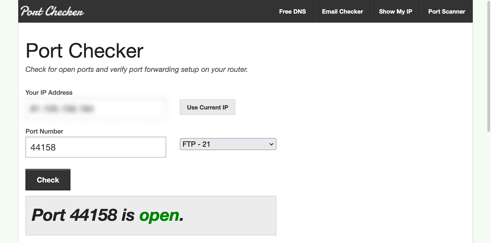

# Using a port checker to validate that the port is opened

With the static IP reservation and port forwarding rule in place, you'll want to ensure these rules are working correctly. 

Using a service like [Portchecker](https://portchecker.co/) is the quickest way to determine if the port is open. You'll need to goto this website using the same internet connection as your Helium Hotspot. The IP address displayed will be your public IP address.

You'll need to update the port number from `21` to `44158`, then press **Check**. You should then see that the port is open.

If you don't see `Open` you will need to review your port forwarding settings and attempt again.

:::info
Some routers will require a restart for the changes to take affect. If you do restart your router give it 15-30minutes to fully restart before testing again.
:::
