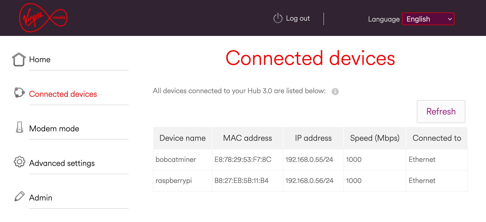

# Identifying your miners IP address

You'll need to understand what the IP address of your miner is in order to make the appropriate changes on your router so it makes sense to start there.

You'll need to log into the interface of your router provided by your ISP through your browser.

1. Enter the admin IP address for your router, this will either be found on the bottom of your router. It's usually something like 192.168.0.1
2. Enter the username / password for your admin interface (Usually specified on your router).
3. Once logged in, you'll want to look for an option that refers to Connected Devices or DHCP leases. Once you've click on that part of the interface you should see a list of devices that are connected to your network.
4. Look for your miner in the list. Bobcat miners are usually referred to as 'bobcatminer'. Once you've located your device you'll see a Mac Address and IP address of the device. You'll need this information for giving your miner a static IP address.

