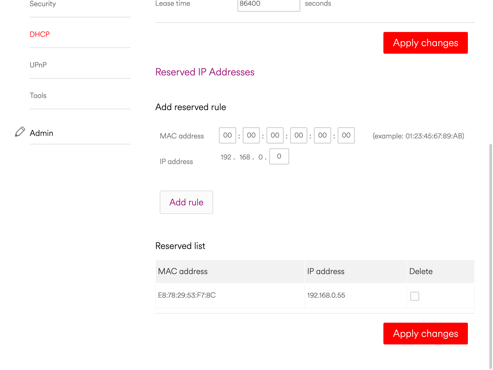

# Setting a static IP address for your miner

A static IP address ensures the device connected to your router can always be referenced by the same unique address, rather than a dynamic address which updates after a set period of time (also known as a lease).

You'll need to locate an area in the router interface that is called Static IPs or Reserved IP address, from his screen you'll be able to set your miner to use a static IP.

1. Add a rule
2. Enter the IP address of the miner
3. Enter the MAC address of the miner, this is a unique hardware address for your miner and its found in the first step, or often included in a sticker attached to your miner. Its made up of 12 alphanumeric characters `xx:xx:xx:xx:xx:xx`
4. Save/Apply the rule, this will now ensure your miner uses the same address

:::note
If you change between ethernet / WIFI after setting your static IP, you'll need to setup a new reservation for the other network adapter.
:::
