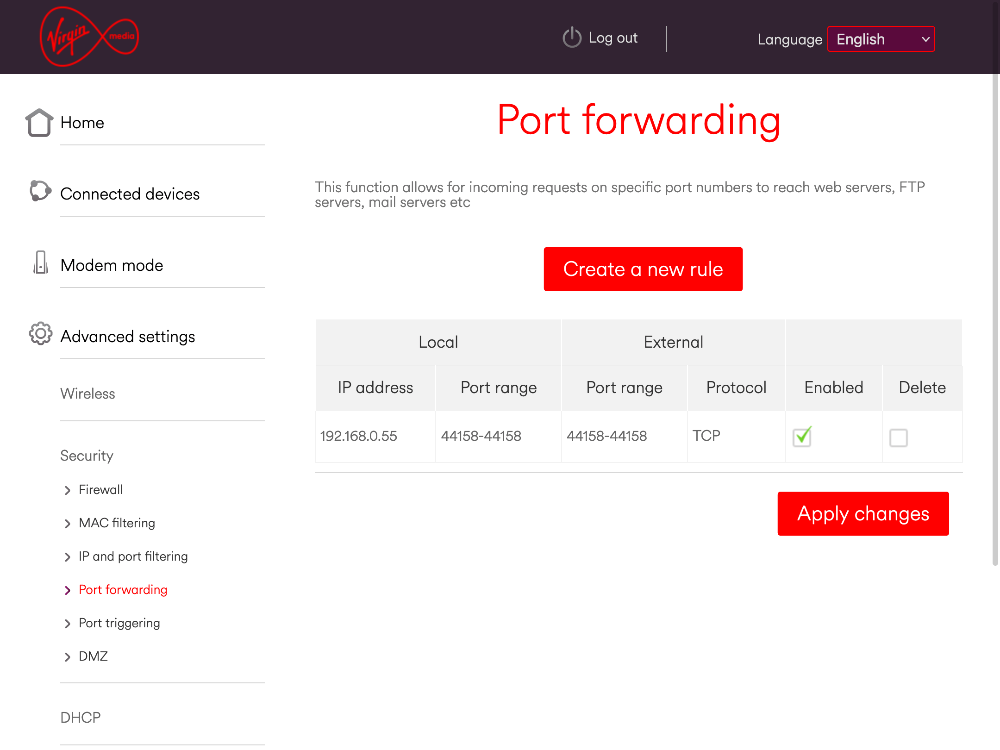

# Setting up port forwarding

With your static IP reservation in place, it's now time to set your router to allow incoming and outgoing TCP traffic for your miner via port 44158. You do this by going to a Port Forwarding menu in your router admin interface.

1. Add a new port forwarding rule
2. You need to enter the IP address for your miner.
3. Then you'll need to enter a start and end port for local and external ports. Enter `44158` in each instance.
4. If you are asked for protocol set it to TCP
5. You'll need to ensure this rule is enabled, usually via a checkbox or a dropdown menu.
6. Save this rule.

