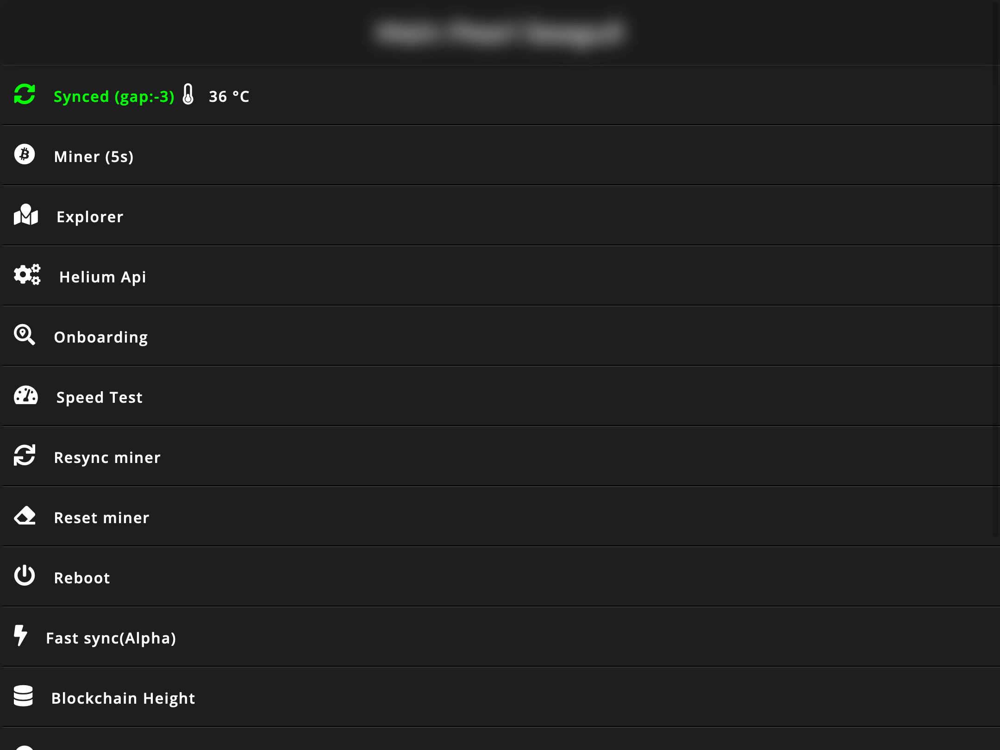
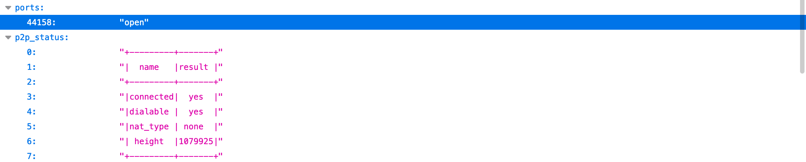
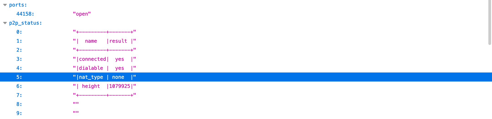

# Validating relay status on your miner

So the Helium app is stating you are relayed. Before you make any changes to your router settings or start restarting your miner. You'll want to view the status directly from your router.

If you are using a Bobcat miner then head to the web interface by entering the IP address of your miner in your web browser.

Once the interface has loaded, press Miner (5s) this will take 5 seconds to load a JSON file containing information about your miner.

You're looking for the following items from the Miner JSON.

**Ports: 44158** – This value need to be set to open

**nat_type** – Anything other than `none` will see your miner with a Relayed status on the Helium App/Explorer.

